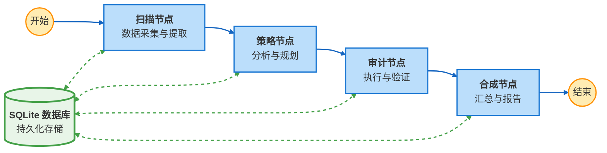

# DueDiligAI ---正在更新中
DueDiligAI是一个全面分析GitHub项目质量的可靠助手
# 🛠️ CodeAnalyst AI: 深度代码尽调专家
CodeAnalyst AI 是一款基于多智能体（Multi-Agent）架构的开源代码仓库分析与技术尽调工具。它不满足于简单的静态扫描，而是通过模拟 CTO 视角，对项目进行 **“宏观统计 + 微观审计”** 的双重逻辑对撞，为代码仓库提供全方位的技术评估。

## 🌟 功能特性

#### 1. 宏观 vs 微观对撞分析
不止关注 Star 数等外部指标，更结合代码实际质量（如安全漏洞、工程规范合规性）进行交叉验证，避免 “虚高” 项目误判。
#### 2. 双轨审计逻辑
核心轨道 (Primary Tracks)：精准锁定算法实现、核心模拟逻辑、系统架构设计等关键代码模块，进行深度穿透式扫描。<br>
抽检轨道 (Random Tracks)：随机捕获边缘模块、辅助工具类中的 “代码异味”（如冗余代码、不规范命名、潜在 Bug），真实反映项目工程纪律水平。
#### 3. 去本地依赖设计
完全基于 GitHub API 实现数据拉取与分析，无需执行 git clone 操作，彻底告别网络超时、庞大仓库磁盘占用等问题，轻量化运行。
#### 4. 深度推理引擎
内置 DeepSeek-V3 / GPT-4o 级别的推理逻辑，能够精准识别 “错误掩埋”“过度工程”“循环依赖” 等高级代码反模式，输出专业级问题诊断。
#### 5. 专业/友好双版本支持
提供CTO专业版与开发者友好版两个版本的代码技术尽调报告，兼顾专业性和用户友好性。

## 🏗️ 架构概览
CodeAnalyst AI 采用多智能体协同架构，各模块职责清晰、高效联动：
#### 1. Scanner（宏观扫描智能体）
核心能力：抓取 GitHub 项目核心指标（活跃度、贡献者数量、Issue 解决效率、版本迭代频率）<br>
输出：项目宏观健康评分及指标明细
#### 2. Strategist（战略规划智能体）
核心能力：解析项目 README 文档、目录树结构，智能筛选 3-5 个最具审计价值的核心文件<br>
输出：核心文件清单及筛选依据
#### 3. Auditor（审计专家智能体）
核心能力：并发执行多维度审计（代码规范、安全风险、性能瓶颈、可读性），定位问题并关联具体行号<br>
输出：带行号引用的精细化技术审计报告
#### 4. Synthesizer（终审汇总智能体）
核心能力：整合宏观指标、核心文件审计结果，进行 “逻辑对撞” 验证（如外部活跃度与内部代码质量的一致性）<br>
输出：Markdown 格式的 CTO 级别综合评估报告

## 🏗️高级系统架构
本项目还可采用 LangGraph 驱动的多智能体协同架构，实现状态持久化与断点续跑：



## 示例报告：对 LangChain 的完整技术尽调
<details>
<summary>点击展开/收起 LangChain项目完整输出报告</summary>
<br>
  # 🚀 技术项目接入与学习深度评估-代码方面

## 1. 项目定位与成色 (Project Positioning)
这是一个 **生态庞大但需加固的生产力框架**。LangChain 已经成功从一个探索性的“胶水代码库”演变为构建大语言模型应用的事实标准框架之一。其代码库展示了工业化设计的雏形（清晰的抽象层、模块化结构），但其内部实现，尤其是在安全性和并发健壮性方面，尚未完全匹配其“生产就绪”的定位。

## 2. 核心竞争力 (Highlights)
*   **优秀的抽象设计**：如审计所见，`agents.py` 中的 `AgentAction`、`AgentStep` 等核心类清晰地定义了Agent执行的工作流，这对于理解和学习如何构建复杂的LLM应用至关重要。`language_models/__init__.py` 中的动态导入机制虽然简单，但也体现了面向接口和惰性加载的设计思想。
*   **强大的生态与社区**：12万+的星标和极高的Issue解决率，意味着一个异常活跃的社区。任何你在使用中遇到的问题，极有可能已有解决方案或正在被积极讨论。这对于学习和快速原型开发是无价之宝。
*   **快速迭代与演进**：最后一次提交是“0天前”，表明项目处于高速发展和维护中。你能接触到最前沿的集成模式和应用范式，学习价值极高。

## 3. 宏观活跃度与维护现状
根据Scanner数据，项目状态为 **“Healthy & Actively Maintained”**。核心指标近乎完美：
*   **超高活跃度**：持续每日提交。
*   **优秀的社区响应**：高达97.78%的Issue解决率，且开放Issue数量（198）相对于其体量非常低。
*   **极受欢迎**：星标和Fork数证明其已被社区广泛采纳和分叉。

**结论**：项目生命力旺盛，社区支持强大，接入后遇到问题获得帮助的可能性很高。

## 4. 评估报告
**这是一个“学习价值极高，但生产接入需谨慎评估”的项目。**

*   **对于学习与研究**：**强烈推荐**。其代码是学习如何设计、抽象和集成大语言模型应用的绝佳范本。你可以快速理解业界主流模式，并基于其生态构建原型、验证想法。
*   **对于生产环境接入**：**有条件推荐**。其宏大的生态和便利的API能极大提升开发效率。**但是**，审计揭示的**安全漏洞和高并发风险是实实在在的生产环境“拦路虎”**。直接将其作为业务核心逻辑的底层框架，意味着你将继承这些风险。

**核心矛盾在于**：项目在宏观上取得了巨大成功，吸引了海量用户和贡献者，但微观的代码质量（尤其是安全与健壮性）并未跟上其扩张速度，存在“重功能、轻安全”的典型技术债。

## 4. 接入/上手避坑指南 (Practical Tips)
基于微观审计，以下是具体、务实的“避坑”建议：

1.  **安全加固是第一要务**：如果计划用于生产，必须对 `langchain_core` 的核心模块（特别是`agents`, `chains`, `tools`相关）进行**深度安全审计和定制化加固**。
    *   **工具调用链**：严格实现审计报告中的 `validate_tool_name` 白名单机制，防止恶意工具调用或路径注入。
    *   **输入消毒**：在所有Agent的输入、输出路径（如`tool_input`, `observation`, `log`）强制实施长度、深度和类型校验。实现并替换原生的`safe_json_dumps`。
    *   **序列化安全**：审查并确保任何来自外部的配置、状态的反序列化（如`Serializable`相关逻辑）是安全的，禁止任意类加载。

2.  **关注并发与性能**：
    *   在高并发场景下，需评估JSON序列化、消息对象复制带来的内存和CPU开销。考虑引入更快的序列化库（如`orjson`）和对象池。
    *   注意动态导入（如`language_models/__init__.py`）在冷启动时可能导致的并发重复导入问题，可参考审计建议添加双检锁。

3.  **小心使用“社区”与“实验性”模块**：
    *   如`apify_dataset.py`所示，迁移到`langchain-community`包中的组件，其错误处理和API健壮性可能参差不齐。务必阅读源码，添加必要的异常捕获和降级逻辑。
    *   对于标记为“deprecated”的模块，切勿直接使用，应遵循官方指引迁移。

4.  **测试环境也需隔离**：
    *   审计发现测试工具（`conftest.py`）中YAML解析存在安全风险。**确保你的CI/CD环境与核心业务隔离**，避免恶意测试用例导致的安全事件。

## 5. 评估完整度说明
本次评估基于：
1.  **宏观统计数据**：完整、可靠，反映了项目的整体健康状况。
2.  **核心审计**：涵盖了最核心的`agents.py`和`language_models/__init__.py`，并尝试审计`chains`模块。`agents.py`的审计极其深入，暴露了框架最核心执行引擎的典型问题。然而，LangChain是一个巨型项目，未审计的模块（如具体工具实现、记忆模块、向量存储集成等）可能包含其他类型的问题。
3.  **随机抽检**：反映了项目在**非核心路径和测试代码**上的质量把控水平，其暴露的问题（异常处理粗糙、安全意识片面）具有代表性。

**结论**：虽然审计样本有限，但已触及核心架构层和代码文化层面，据此做出的“需谨慎加固”的判断是成立的。

## 6. 开发者决策建议
*   **学习推荐度**: **95** (设计模式清晰，生态丰富，是学习LLM应用架构的首选之一)
*   **生产接入度**: **65** (功能强大，生态赋能，但需投入额外精力进行安全加固和性能调优，否则风险自担)
*   **最佳适用场景**:
    *   **快速原型验证与内部工具开发**
    *   **作为参考架构，学习后自研更可控的核心引擎**
    *   **对安全要求不高、流量可控的演示或辅助性功能**
    *   *慎用于处理敏感数据、高并发、对稳定性要求极高的核心商业逻辑*
*   **上手首要任务**：**不要直接`pip install`就上生产**。首先，基于本次审计报告，对你计划使用的核心模块进行**代码走读和安全审查**，制定具体的加固和监控方案。可以优先考虑在隔离环境中搭建原型，同时并行进行核心模块的加固工作。
</details>

## 安装

1. 克隆仓库
```bash
git clone <repository-url>
cd <repository-name>
```

2. 安装依赖
```bash
pip install -r requirements.txt
```

3. 配置环境变量<br>
本项目使用 OpenRouter 作为统一的 LLM 接入平台。当然，如果用户有自己的LLM平台可以替换，仅需配置base_url和api_key即可。<br>
复制 `.env.example` 为 `.env` 并填写你的配置：
```bash
cp .env.example .env
```

编辑 `.env` 文件，设置以下必需的环境变量：
- `GITHUB_TOKEN`: GitHub Personal Access Token
- `LLM_API_KEY`: LLM API密钥（或使用特定提供方的密钥）

## 使用方法

### 基本使用

```bash
python code_analysit.py --repo-url https://github.com/owner/repo
```

### 命令行参数

```bash
python code_analysit.py \
  --repo-url https://github.com/owner/repo \
  --primary-audit-model gpt-4o-mini \
  --random-audit-model qwen-plus \
  --strategist-model gpt-4o-mini \
  --synthesizer-model deepseek-v3 \
  --config config.json
```

### 环境变量配置

所有配置都可以通过环境变量设置：

```bash
export GITHUB_TOKEN=your_token
export LLM_API_KEY=your_api_key
export PRIMARY_AUDIT_MODEL=gpt-4o-mini
export RANDOM_AUDIT_MODEL=qwen-plus
export STRATEGIST_MODEL=gpt-4o-mini
export SYNTHESIZER_MODEL=deepseek-v3
```

### 配置文件

创建JSON配置文件（可选）：

```json
{
  "default_model": "gpt-4o-mini",
  "model_provider": "vectorengine",
  "primary_audit": "gpt-4o-mini",
  "random_audit": "qwen-plus",
  "strategist": "gpt-4o-mini",
  "synthesizer": "deepseek-v3"
}
```

使用配置文件：
```bash
python code_analysit.py --repo-url <url> --config config.json
```

## 环境变量说明

### 必需的环境变量

- `GITHUB_TOKEN`: GitHub Personal Access Token
- `LLM_API_KEY`: LLM API密钥（或使用特定提供方的密钥）

### 可选的环境变量

#### GitHub配置
- `GITHUB_PROXY`: GitHub API代理地址（可选）


#### 模型配置
- `DEFAULT_MODEL_NAME`: 默认模型名称（默认：gpt-4o-mini）
- `PRIMARY_AUDIT_MODEL`: 主审计模型（默认：gpt-4o-mini）
- `RANDOM_AUDIT_MODEL`: 随机审计模型（默认：qwen-plus）
- `STRATEGIST_MODEL`: 策略规划模型（默认：gpt-4o-mini）
- `SYNTHESIZER_MODEL`: 综合报告模型（默认：deepseek-v3）

## 项目结构

```
.
├── code_analysit.py      # 主程序入口
├── scanner.py            # GitHub仓库扫描模块
├── strategist.py         # 审计策略规划模块
├── auditor.py            # 代码审计模块
├── synthesizer.py        # 报告综合模块
├── configs/              # 配置模块
│   ├── env_config.py     # 环境变量配置管理
│   ├── model_config.py   # 模型配置管理
│   └── llmconfig.py     # LLM调用接口
├── utils/                # 工具模块
│   └── github_reader.py  # GitHub API读取器
├── prompts/              # 提示词模板
│   ├── auditor.yaml
│   ├── strategist.yaml
│   └── synthesizer.yaml
├── .env.example          # 环境变量示例
└── README.md            # 本文件
└── LICENSE              # 许可证
```
## ⚠️ 免责声明 (Disclaimer) 
本项目生成的审计报告仅供技术参考与学习交流，不构成任何形式的投资建议或生产环境接入保障。LLM 可能产生幻觉，请在根据报告做出决策前，由人工进行二次核实。作者不对因使用本工具导致的任何代码损失、系统故障或法律纠纷承担责任。
## 安全说明

⚠️ **重要**：本项目已完全移除所有硬编码的敏感信息（API密钥、Token等）。所有敏感信息必须通过环境变量或`.env`文件配置。

- ✅ 所有API密钥从环境变量读取
- ✅ 已删除包含硬编码密钥的配置文件
- ✅ `.env`文件已添加到`.gitignore`
- ✅ 提供了`.env.example`作为配置模板

## 许可证
本项目基于 MIT 许可证开源，完整许可文本见 LICENSE 文件

## 贡献

欢迎提交Issue和Pull Request！


